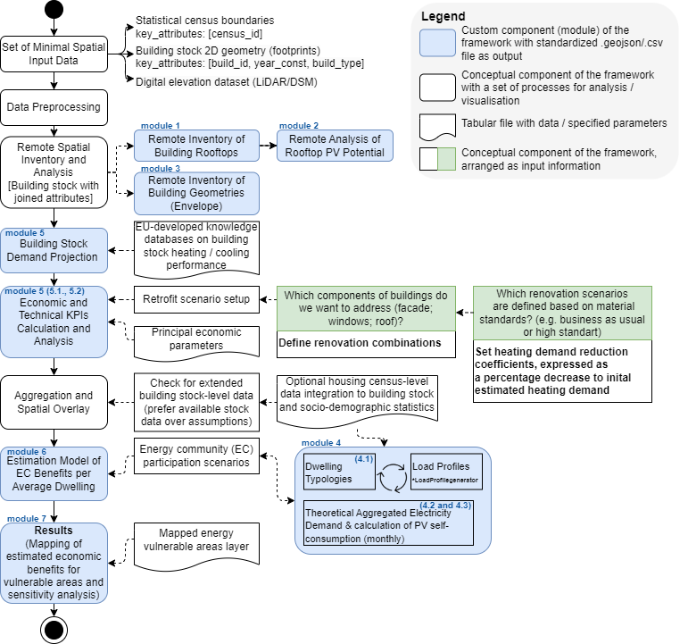

# ⚡ SPACER-HB Framework  
**Spatial Pre-feasibility Assessment for Community Energy, Renovation, and Household Benefits**

---

## What is SPACER-HB?

SPACER-HB is an ad-hoc, spatial, and public-data-based methodological framework for early-stage local energy community (EC) planning. It integrates solar rooftop and buildings' facade renovation potential inventory with household-level energy vulnerability mapping to support informed pre-feasibility decisions.  It enables exploration of energy community scenarios and identification of priority areas, without requiring detailed local data or complex models.


## Main purpose of the framework:
1. To provide an adaptable set of custom tools that help in spatial assessment of the potential for local energy communities. It utilizes publicly available data and open-source tools to estimate building energy demand, the impacts of renovations, and solar rooftop potential. 
2. The framework combines statistical census data (LAU2, LAU1) with building-level information in a unified data workflow to estimate community solar self-consumption, average household savings, and the effects of various pricing rules—using only publicly available data and no private metering.

### 🧭 Framework Overview



- **Python libraries and Anaconda environment:**
    
    Python ver used: 3.9.16

    Anaconda environment snapshot with pip installed packages:          [spacer-hb_environment.yml](./00_set_up_directories/spacer-hb_environment.yml)
- **QGIS and Whitebox plugin:**
    
    QGIS version used: 3.32.3
    
    Whitebox tools: [Whitebox Workflows for Python](https://www.whiteboxgeo.com/whitebox-workflows-for-python/)

    More about Whitebox products open-source/commercial licence: [here](https://groups.google.com/g/whiteboxtools/c/p6P1n3LRWHo?pli=1)

- **LoadProfileGenerator Tool:**
    Version:10.10  

    Database: [Adjusted example used for case study](./LoadProGen/first_lgp_test.db3)

> **!! IMPORTANT: It is important to ensure the same coordinate system from the beginning !!**

> **Working directory set-up by default built in a simple way, i.e it is assumed to be a single project (i.e: single Case Study per root directory tree).**

#### Methodology & Structure
This framework is implemented through a customized set of Python tools and methods, integrated within a Jupyter Notebook:
📓 [main_jp_notebook.ipynb](./main_jp_notebook.ipynb)

##### 📁 Project Directory Principal Structure

```text
root_folder/
│
├── lidar/
│   └── Contains raw LIDAR files for the area of interest. These files are the input for further spatial processing via Whitebox Tools: Rooftop Analysis.
│
├── pyqgis_whitebox_tool/
│   └── Stores output from LIDAR processing scripts run via the PyQGIS console [is created upon script run].
│
├── raster/
│   └── Holds supporting raster datasets (e.g., land cover, elevation models) used in analysis.
│
├── vector/
│   └── Contains project-related vector files, including:
│       - Building footprints
│
├── LoadProGen/
|    └── Includes electricity load profiles for households. These are used for energy demand analysis within the framework.
|
└── data/
    └── Stores temporary and Python scripting Modules' output data files
```

It was developed as part of a PhD dissertation titled "Exploring and Supporting Energy Communities through Spatially Integrated Methods in Local Energy Planning." 

The framework, as a methodological proposal and toolkit for ECs planning, expands upon the published study:
O. Husiev, O. U. Arrien, and M. Enciso-Santocildes, “Spatial analysis of energy communities and energy vulnerabilities in Spain,” Utilities Policy, vol. 95, p. 101954, Aug. 2025, doi: 10.1016/j.jup.2025.101954
It integrates various aspects, such as building stock geometric inventory, energy flexibility, and renewable energy deployment estimation.

The framework links census-level statistical boundaries with building-specific data, combining geospatial vector/raster layers and tabular inputs. Python-based automation scripts streamline several core processes. While this project does not include full front-end/backend integration or database infrastructure, it builds on open-source tools otherwise available only as commercial software or requiring large, detailed datasets. To demonstrated 

#### 🧰 Design Principles
Rather than providing a fully optimized or production-ready software stack, the framework focuses on:

- Accessibility and transparency

- Semi-automated scripting (Python + QGIS)

- Adaptability to public data

- Open-source methodology

It serves as a realistic, reproducible tutorial for researchers, municipalities, energy analysts, and citizen energy enthusiasts interested in:

- Spatial mapping of energy vulnerability

- Estimating socio-technical renovation potential

- Building data pipelines with modest technical capacity

#### 📊 Input Data and Processing
Key parameter definitions and scenario variables are defined in Excel:
📄 [00_input_data.xlsx](./00_input_data.xlsx)

Intermediate data is exchanged through .xlsx, .csv, and .geojson formats, processed with:

Python libraries: pandas, geopandas, shapely

Open-source GIS software: QGIS (for visual inspection and manual adjustments, file: [qgis_project_map](./qgis_project_map.qgz)) [to be improved]

##### Module 4 Input File:
The file [00_mod_04_input_data_census_id_ener_consum_profiling.xlsx](./00_mod_04_input_data_census_id_ener_consum_profiling.xlsx) contains input data used in Module 4. It supports the assignment of dwelling typologies based on socio-demographic census data and includes a custom interpretation of energy consumption profiles per dwelling type.

# ⚠️ Disclaimer
- This framework is not performance-optimized, nor fully validated for production-grade software engineering. It has been:

- Manually checked during key lifecycle stages: requirements, design, implementation, integration

- Functionally tested only for core component consistency (unit/system-level)

- It aims to demonstrate a semi-automated, spatially extended workflow that is accessible for engineers and enthusiasts not primarily involved in software development, especially with the emergence of AI-powered agents in user workflows. It is intended for high-level scenario testing and mapping, not detailed simulation or modeling.

## 🔄 Current Limitations and Next Steps
Although the framework covers spatial processing and workflow design, some components remain under development:

### Planned Improvements
- ⚙️ Align codebase closer to basic principles of PEP8 and OOP practices

- 📊 Add interactive visualizations as a dashboard-like presentation and output exploration

- 🛢️ Integrate lightweight database functionality (e.g. DuckDB) for smoother data flow


